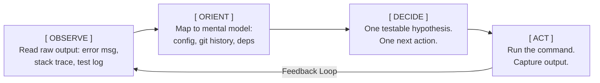

# Active Debugging: OODA Loop + Save Point

Open this file when **actively running commands to fix a failing test, broken build, or production issue**. This is the operational execution layer — Step 1 (Cynefin) tells you *what kind* of problem it is; this file tells you *how to run the loop*.

## The Save Point Rule (read first)

Before touching anything:

```bash
git status                            # must be clean
git log -1 --format='%H %s'           # record HEAD
git tag debug-baseline-$(date +%s)    # movable reference for one-command reset
```

**Hard rule**: every change starts from this save point. If the change fails, you `git reset --hard debug-baseline-*` before trying the next thing. **Never stack unverified changes** — you lose the ability to tell which change broke (or fixed) what.

## OODA Loop



### OBSERVE — read the raw signal, no interpretation

- Read the **full** stack trace, not just the headline error.
- Note the calling test name, the line number, the preceding frames.
- Don't skip warnings. They're often the actual clue.

### ORIENT — map observation to system model

Cross-reference in parallel:
- **Git history**: what changed recently? `git log -p -- <file>` and `git diff <green>..<red>`.
- **Call graph**: who calls this function? what data does it pass?
- **Contract**: if the failing line consumes an API or DB result, check the actual current shape vs. what the code expects.

### DECIDE — one hypothesis, one action

Form a single, falsifiable statement:

> "Line 42 calls `.map` on `X`. `X` is `undefined` because the mock fixture at `tests/mocks/users.ts` omits the `permissions` array. Probe: `console.log(typeof X, Object.keys(X || {}))` before line 42."

**Refuse these anti-patterns**:
- "Let me add `?.map` and also rewrite the function and also fix the mock" — multi-variable change, poisons the loop.
- "Let me push to CI to see what happens" — slow, non-deterministic, burns shared pipeline.

### ACT — execute, capture, decide

Run **one** change. Capture the result. Compare against the hypothesis. Three outcomes:

| Observation | Next move |
| :--- | :--- |
| Hypothesis confirmed (probe shows `X` is genuinely `undefined`) | Revert the probe. Apply the real fix at the source. |
| Hypothesis wrong (probe shows a valid array) | `git stash pop` / `git reset --hard debug-baseline-*`. Pick the next MECE hypothesis. |
| New error appears (different stack) | **Revert immediately.** Do not chain fixes. Re-run loop. |

## Hard Rules During the Loop

1. **One change per cycle.** If you need 3 fixes, you don't understand the bug yet — go back to OBSERVE.
2. **Revert between attempts.** Never carry probe code into the real fix commit.
3. **Reproduce locally before pushing to CI.** CI is for verification, not exploration.
4. **Don't declare victory on a green targeted test alone.** Run the full suite + type check.

## Verification Layer (only after the fix is applied)

1. **Targeted test** — the originally failing test goes green.
2. **Full suite** — no previously-passing test breaks.
3. **Type check** — `tsc --noEmit` or equivalent; catches contract regressions cheaply.
4. **CI green on the PR** — the only signal that actually counts.

## See also
- Pre-diagnosis (Cynefin classification): `step-1-problem-diagnosis.md`.
- Hypothesis bucketing (MECE before picking one): `step-4-horizontal-structure.md`.
