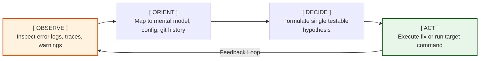

# Applying the Skill as an Agent

When executing a task that requires structured thinking or presenting complex information to the user, follow this two-phase process.

## Phase 1: Pre-computation (Mental Draft)

Before generating the final response, outline your thoughts in your `thought` block:

- **A→B Target**: Who is the user (developer, manager, designer)? What decision or action should they make?
- **SCQA Hook**: What is the context (S), what went wrong (C), what is the core question (Q), and what is my answer (A)?
- **Pyramid Outline**: Map out the top-level conclusion and the supporting arguments.
- **Rule of Three / MECE Check**: Limit core items (findings, risks, steps) to 3 (±1) items. Synthesize longer lists into 3 main buckets. Ensure categories are distinct, complete, and ordered logically.

## Phase 2: Response Template

Adopt this structured output layout:

1. **Core Summary (Pyramid Top)** — A 1-2 sentence executive summary or recommendation at the very beginning (limited to 3 key points).
2. **Context Hook (SCQA)** — A brief intro setting the stage.
3. **Detailed Structure (Pyramid Body)** — Grouped and ordered sections with clear headings and bullet points. Limit main sections or lists to 3 (±1) items. Use **bolding** to emphasize key actions.
4. **Visual Aid (Optional)** — Include a Mermaid diagram or table to illustrate workflows, architectures, or comparisons.

## Example Output Shape

```markdown
## Recommendation

Migrate to PostgreSQL 16 by Q3 to avoid EOL compliance failure.

## Context

We run PostgreSQL 11 (EOL Nov 2025). Compliance audit on Oct 15 will flag
unpatched CVEs. Migration takes ~6 weeks; we have ~14 weeks of runway.

## Plan

1. **Snapshot + replica** (week 1-2) — stand up PG16 replica of PG11 primary
2. **Shadow traffic** (week 3-4) — dual-write from app, compare row counts
3. **Cutover** (week 5) — promote replica, keep PG11 read-only for rollback
4. **Decommission** (week 6) — drop PG11 after 1 week clean operation

## Risks

| Risk                  | Mitigation                              |
| --------------------- | --------------------------------------- |
| Extension incompatibility | Audit `pg_stat_user_functions` first  |
| Replication lag spike  | Alert if lag > 1s during shadow traffic |
```

Notice the order: conclusion → context → plan → risks. This is **ASCQ** ordering — answer first, because the audience (likely an engineering lead) wants the decision before the justification.

## Example 2: Incident Repair Plan (QSCA — Problem First)

```markdown
## The Question

Why are we losing order items in production, and how do we stop it permanently?

## What We Assumed

Our cart-to-order pipeline was atomic — one INSERT, one order.

## What's Actually Happening

Under concurrent checkout, `INSERT ... SELECT` runs without a transaction.
Two sessions read the same cart snapshot and both insert — one silently wins,
the other's items vanish. 4 occurrences this quarter; 1 lost order worth ¥18k.

## The Fix

1. **Wrap in transaction** (week 1) — `BEGIN ... SELECT FOR UPDATE ... INSERT ... COMMIT`
2. **Add idempotency key** (week 2) — client sends UUID; reject duplicates
3. **Reconcile missing orders** (week 3) — backfill from payment records
```

Notice the order: **question → assumed state → reality → fix**. This is **QSCA** — the audience (a product manager who dismissed earlier incidents as "one-off bugs") needs the question framed and the gap exposed before approving a 3-week repair. Contrast with Example 1 (ASCQ), where the engineering lead wanted the answer up front. The A→B rule drives the ordering: same frameworks, different Actor, different sequence.

## Operational Execution: Debugging with the OODA Loop

When actively running commands, diagnosing compiler/test failures, or investigating codebase behavior, do not guess or apply changes randomly. Execute using the **OODA Loop** to establish a rapid, systematic feedback cycle:

> [!NOTE]
> **Cynefin vs. OODA Loop**: Cynefin is used to judge which domain a problem belongs to (pre-decision diagnostic classification), whereas the OODA Loop is the operational mechanism used to execute debugging loops (post-decision active execution). They complement each other: once Cynefin classifies a problem as *Complex* requiring a *Probe*, the OODA Loop is the engine used to run that probe cycle.



1. **Observe (观察)** — Inspect the raw output of commands, compiler warnings, stack traces, and test logs. Focus on the exact lines and error codes. Do not skip warnings.
2. **Orient (定位)** — Map the observations to your mental model of the system. Cross-reference configuration files, package dependencies, and recent git history to understand why the issue occurred.
3. **Decide (决策)** — Formulate a single, testable hypothesis (e.g., "The package dependency is missing because of an incorrect peer dependency version"). Decide on the *single* next action that will test this hypothesis. Avoid multi-variable changes.
4. **Act (行动)** — Execute the decision (e.g., install peer dependency, modify code, run test).

### The Save Point + OODA Rule:
Keep the OODA cycle fast. If an **Act** fails to resolve the issue or introduces new errors, **revert the change instantly** (using git reset/restore) and run the loop again from the last known save point. Never accumulate stacked, unverified changes during debugging.

## Related
- **Cynefin Complexity Classification**: See [step-1-problem-diagnosis.md](step-1-problem-diagnosis.md#cynefin-framework-classifying-problem-complexity) to classify the problem domain before launching your debugging loop.
- **SCQA Hook Reordering**: See [step-2-goal-audience.md](step-2-goal-audience.md#scqa-principle) for details on reordering your final output sequence.

