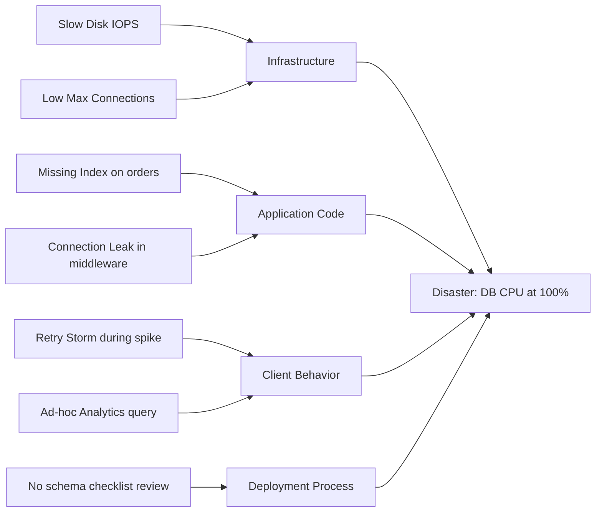

# Step 1: Diagnose the Problem (Cynefin + 5-Why + Fishbone)

Open this file when the task involves **root cause analysis** for an incident or non-trivial bug — especially when causation is unclear.

## Cynefin: Classify Before You Act

Most debugging mistakes come from applying the wrong action pattern to the wrong problem type. Use Cynefin first.

| Domain | Signal | Action | Common mistake |
| :--- | :--- | :--- | :--- |
| **Clear** | Known bug, obvious fix (typo, syntax error). | Sense → Categorize → Respond. Apply best practice. | Over-analyzing trivial bugs. |
| **Complicated** | Requires analysis but causes are knowable (query tuning, perf). | Sense → Analyze → Respond. Compare options. | Jumping to a fix without comparing. |
| **Complex** | Emergent behavior (race conditions, memory leaks, retry storms). **You cannot solve this by reading code.** | Probe → Sense → Respond. Run a *probe* first (telemetry, repro script, profiler). | **Guessing** based on static analysis. |
| **Chaotic** | Active outage, data corruption. | Act → Sense → Respond. Stop the bleeding first (rollback, rate-limit). | Investigating root cause while the system is still down. |

If you classify a problem as Complex and find yourself writing "the cause is probably X, so I'll change Y" — stop. You're guessing. Run a probe instead.

## 5-Why: Push to Process, Not Person

When causation is linear, ask "why" until you hit a **process or system failure**, not an individual mistake. Stop when the answer leads to an enforceable fix.

**Anti-patterns**:
- Stopping at the first convenient answer.
- "Who" instead of "Why".
- Skipping intermediate causes (symptom → "system failure" with no chain).

**Example**:
1. Deploy failed in production.
2. Migration script timed out.
3. Script locked `users` table for 4 minutes.
4. Migration added NOT NULL column without default.
5. Schema review checklist didn't flag missing defaults.
→ **Root cause**: schema review process is unenforced. The fix is a CI check, not a person.

## Fishbone Diagram (Mermaid template)

When presenting root causes to a stakeholder, MECE-classify them into 3-4 categories and render as a horizontal tree:

This forces you to **MECE the hypotheses** (every cause fits exactly one bucket) before trying to fix anything.

## System Dynamics: For Non-Linear Loops

5-Why fails for feedback-loop problems (retry storms, pool starvation, cascading failures). Recognize:

- **Reinforcing loop** (vicious cycle): high CPU → queries slow → connections held longer → clients retry → more load → crash. **Break the loop** (circuit breaker, backoff, rate-limit), don't apply linear fixes like "increase timeout".
- **Balancing loop** (self-stabilizing): load spike → autoscaler → more pods → load per pod drops. Maximize these.

## See also
- Active debugging loop: `agent-workflow.md` (OODA + Save Point).
- Visualizing ranked options: `step-3-vertical-structure.md` (KT Matrix).
