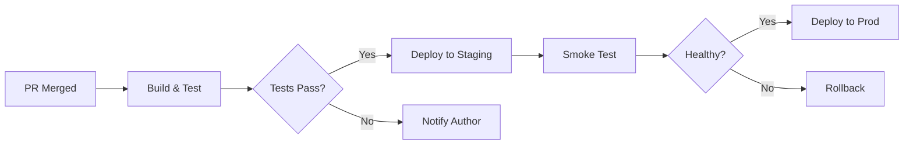
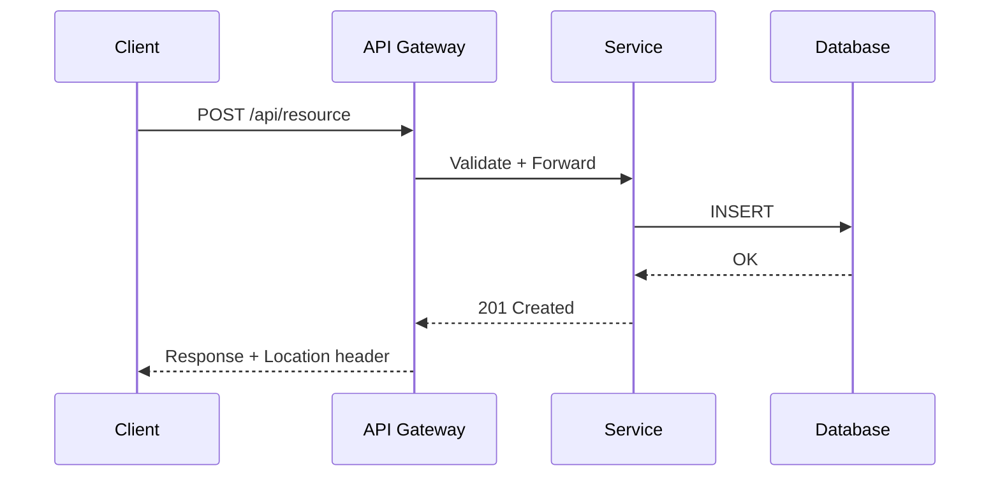
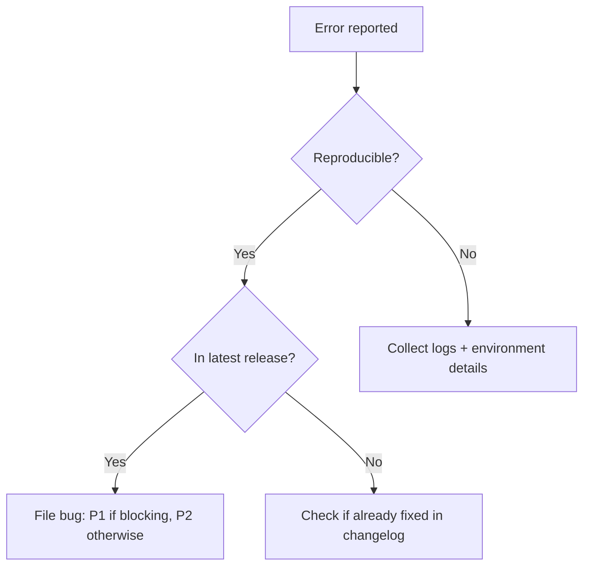
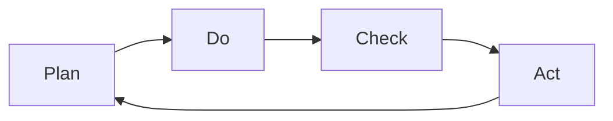

# Step 5: Visualize (Diagram Matching + KT Matrix)

Open this file when prose alone would be slower to grasp than a diagram, or when comparing options visually.

## Match Diagram to Message

Pick the diagram type that matches the relationship:

| Relationship | Diagram type | Example |
| :--- | :--- | :--- |
| Parts of a whole | Pie chart, treemap | Budget allocation |
| Process / flow | Flowchart, swimlane | CI/CD pipeline |
| Repeated loop | Cycle diagram | PDCA, monthly close |
| Causal chain | Causal loop, fishbone | Incident root cause |
| Hierarchy | Tree, org chart, mind map | Taxonomy, file system |
| Comparison | Bar chart, table | Feature matrix, before/after |
| Relationship / network | Node-link, graph | Service dependencies |

## Anti-patterns

- Pie chart with >7 slices (unreadable) — use a bar chart or treemap.
- Flowchart for a 2-step process — just write the two steps.
- 3D / gradient / shadow decoration that doesn't encode information.
- Repeating in prose what the diagram already shows.
- Using a diagram when a 3-row table would be clearer — diagrams should earn their complexity.

## Tools

- **Mermaid** (inline in markdown) — preferred for flowcharts, sequence diagrams, Gantt, simple trees. Renders in GitHub, most markdown viewers.
- **Tables** — preferred for structured comparisons, option matrices. Faster to read than diagrams for <5 items.
- **External** — draw.io / Excalidraw for hand-drawn feel; native chart libraries for data plots.

## Mermaid Templates (copy-paste and adapt)

### Process Flow (CI/CD, deploy pipeline, request handling)

### Sequence Diagram (API calls, service interactions)

### Decision Tree (troubleshooting, triage)

### Cycle Diagram (feedback loops, iterative processes)

## KT Matrix Reference

The Kepner-Tregoe decision matrix is detailed in `step-3-vertical-structure.md`. The short version: classify criteria into MUSTs (binary gates) and WANTs (weighted scores), then run a risk assessment (P × S) on the winner.

Use a KT Matrix **whenever you have 2+ options and the audience needs to see why one was chosen**. The matrix replaces paragraphs of justification with a scannable table.

## See also
- KT Matrix full template: `step-3-vertical-structure.md`.
- Fishbone cause-and-effect diagram: `step-1-problem-diagnosis.md`.
- OODA cycle diagram: `agent-workflow.md`.
