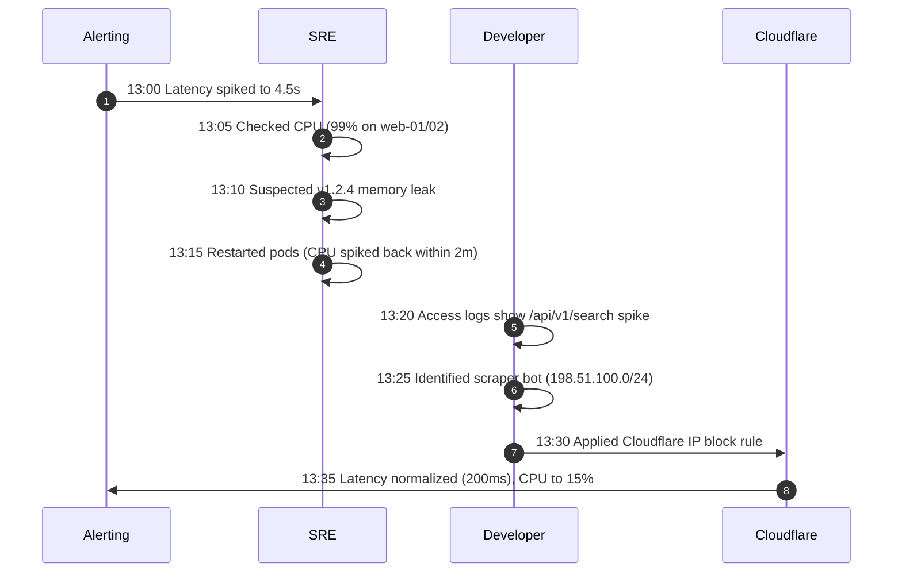

# Incident Postmortem: API Latency Spike & Scraper Bot Mitigation

**Executive Summary**: The 35-minute API latency spike on June 17, 2026, was resolved at 13:35 by blocking a scraper IP range (198.51.100.0/24) in Cloudflare. We recommend implementing per-IP rate limiting and bot detection to prevent future catalog scraping outages, requiring 1 engineer-week of effort.

---

### 1. Root Cause: Unthrottled Scraper Bot Flooding Search API
A scraper bot targeted the `/api/v1/search` endpoint from the IP range `198.51.100.0/24`, sending a high volume of requests to harvest our product catalog. Because this endpoint is computationally expensive and lacked rate limiting, the flood of requests saturated the CPU on our web servers (`web-01` and `web-02`), driving usage to 99% and spiking overall API latency from a baseline of 200ms to 4.5 seconds.

### 2. Response Timeline: Initial Misdiagnosis Delayed Resolution
The outage lasted 35 minutes due to an initial false hypothesis regarding a memory leak in the recently deployed version `1.2.4`. 

* **Mitigation Analysis**: Pod restarts at 13:15 failed to solve the issue because the scraper immediately re-established connections, driving CPU back to 99% within 2 minutes. The incident was resolved only after access logs were analyzed and the traffic source was blocked at the CDN layer.

### 3. Durable Prevention: Implementing Rate Limiting and WAF Rules
To prevent similar scraper-induced resource exhaustion, we propose the following actions:
* **Immediate WAF Rule (Q1 - High Priority)**: Enable Cloudflare Bot Management and set rate limits specifically for the `/api/v1/search` endpoint.
* **Application-Level Rate Limiting (Q1 - High Priority)**: Implement Redis-backed per-IP rate limiting on expensive API endpoints.
* **Playbook Optimization (Q2 - Medium Priority)**: Update SRE incident response playbooks to require checking access log request distributions before performing pod restarts for high CPU alerts.

---

### Decisions Requested
1. **Approval of 1 engineer-week** of development time to implement application-level rate limiting and configure Cloudflare bot protection.
2. **Approval of the updated SRE playbook** enforcing log analysis prior to infrastructure restarts.
