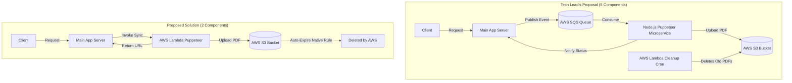

# Proposal: Serverless PDF Generation with Native Cloud Expiration

We should reject the tech lead's 5-component architecture in favor of a serverless, single-responsibility AWS Lambda function running headless Chrome, and replace the custom cleanup Lambda with native S3 Lifecycle rules. This reduces the infrastructure footprint from five components to two while preserving resource isolation and eliminating standing server costs.

---

### 1. Puppeteer resource constraints justify isolation, but queues and custom cleanups are redundant

While the tech lead is correct that PDF generation should be isolated from our main API server, the proposed implementation details introduce unnecessary operational complexity:

* **Event Loop Blocking & OOM Risks:** Headless Chrome (Puppeteer) requires a fundamental minimum of ~150MB RAM per tab and spikes CPU during layout rendering. Spawning it on our main API server would block Node’s single-threaded event loop and risk Out-Of-Memory (OOM) crashes. Isolation is a **MUST**.
* **Unnecessary Message Queueing:** Introducing AWS SQS requires asynchronous polling or WebSockets to notify the client when the PDF is ready. Since invoice generation is transactional and takes under 3 seconds, a synchronous serverless invocation yields a faster user experience with zero queueing overhead.
* **Reinventing Built-in Cloud Features:** Writing, testing, and scheduling a custom AWS Lambda to clean up old S3 PDFs is an anti-pattern. AWS S3 provides native **Object Lifecycle Policies** that can automatically expire and delete files after $N$ days with zero code and zero execution cost.

---

### 2. Streamlined architecture isolates compute and leverages cloud-native deletion

By shifting to a serverless model and using native S3 features, we collapse five components into two. 



* **AWS Lambda with Chromium:** We deploy a single Lambda using `@sparticuz/chromium`. When a user requests an invoice, the main server invokes the Lambda synchronously, gets the PDF, and returns it. This scales automatically and incurs zero cost when idle.
* **S3 Lifecycle Policy:** We store generated PDFs in an S3 bucket configured with a native Lifecycle Rule:
  ```json
  "Rules": [{
      "Status": "Enabled",
      "Expiration": { "Days": 1 }
  }]
  ```
  AWS handles the deletion automatically, removing the need for a separate cleanup cron.
* **Direct Buffering (Alternative):** If the PDF only needs to be downloaded instantly (and not emailed asynchronously), we can bypass S3 entirely and stream the PDF binary buffer directly from the Lambda through the main server to the user.

---

### 3. Kepner-Tregoe Matrix identifies Serverless Puppeteer as the optimal trade-off

#### MUSTs (Binary Gate)

| Option | MUST: Isolate CPU/RAM Spikes | MUST: Support CSS Layout Fidelity | Status |
| :--- | :--- | :--- | :--- |
| **A: Tech Lead's Proposal** | YES (Separate Microservice) | YES (Puppeteer) | **GO** |
| **B: Inline PDF Engine (PDFKit/App Server)** | NO (Blocks App Event Loop) | NO (No HTML/CSS engine) | **NO-GO** |
| **C: Serverless Puppeteer (Lambda + S3)** | YES (Isolated Lambda sandbox) | YES (Puppeteer) | **GO** |

*Option B fails because inline engines like PDFKit require drawing layouts imperatively using coordinate vectors, which dramatically increases developer efforts for complex styling, while running Puppeteer inline would threaten app stability.*

#### WANTs (Weighted Score)

| Criterion | Weight | Option A (Tech Lead) | Option C (Serverless) |
| :--- | :--- | :--- | :--- |
| **Minimal Infrastructure Complexity** | 9 | 3 / **27** (Service, queue, Lambda, S3, IAM) | 9 / **81** (Lambda, S3) |
| **Zero Standing Costs** | 8 | 4 / **32** (Continuous container cost) | 10 / **80** (Scale to zero) |
| **Implementation Speed** | 7 | 5 / **35** (Multiple pipelines, cron scripts) | 8 / **56** (Single serverless deploy) |
| **Total Weighted Score** | — | **94** | **217** |

#### Risk Assessment & Pre-Mortem (Option C)

* **Threat 1: Cold start latency for Puppeteer in Lambda** (Probability: 8/10, Severity: 4/10, Score: **32**)
  * *Mitigation:* Optimize the package size using compressed Chromium binaries and assign 2GB of memory to the Lambda to decrease start-up CPU times.
* **Threat 2: Memory exhaustion on multi-page invoices** (Probability: 3/10, Severity: 7/10, Score: **21**)
  * *Mitigation:* Conduct a pre-deployment stress test with a 100-page invoice mock and set an execution timeout limit of 30 seconds on the Lambda function.

---

### Decisions Requested

1. **Do we need S3 storage for email attachments?**
   * *Choice 1:* Yes. We need to email the invoice link (S3 bucket with 1-day expiration rule is required).
   * *Choice 2:* No. The PDF is only ever downloaded inline via the browser (we can stream the buffer directly and skip S3 entirely).
2. **Should we use AWS API Gateway or direct SDK invocation?**
   * *Choice 1 (Recommended):* Direct SDK invocation using the AWS SDK from the app server to secure the Lambda behind existing IAM roles without exposing a public endpoint.
   * *Choice 2:* API Gateway (creates a public HTTP endpoint for the PDF engine, requiring API key validation).
